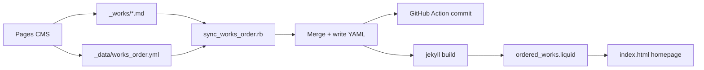

# Works order on the homepage

The homepage work list order is **not** Jekyll’s default collection order. It is controlled by **`_data/works_order.yml`**, which you can edit in **Pages CMS** (drag-and-drop under “Order of works”).

Custom Jekyll plugins in **`_plugins/`** often do **not** run on Netlify (and plugin writes never land back in git for Pages CMS). This site uses a **pre-build script**, a **GitHub Action**, and a **Liquid include** so order works in production and in the CMS.

## Related files

| File | Role |
|------|------|
| `_data/works_order.yml` | Saved order (slug list), edited in Pages CMS |
| `lib/works_order_sync.rb` | Merge logic (preserve order, append new, drop removed) |
| `scripts/sync_works_order.rb` | CLI entry point |
| `netlify.toml` | Runs sync script before `jekyll build` |
| `.github/workflows/sync-works-order.yml` | Commits updated YAML after new works are pushed |
| `_includes/ordered_works.liquid` | Homepage ordering without the plugin |
| `_plugins/works_order_generator.rb` | Optional: local `jekyll serve` sync + injection |
| `.pages.yml` | Pages CMS UI for reordering |
| `index.html` | Includes `ordered_works.liquid` |

---

## The data file (`_data/works_order.yml`)

The YAML uses this shape:

```yaml
order:
  - slug: katib-e-taqdeer
  - slug: colloquium
  # ...
```

Each entry is a **slug**: the work’s URL path without slashes. Slugs match the works collection permalink `/:name/` — for example, `name: katib-e-taqdeer` in front matter becomes URL `/katib-e-taqdeer/` and slug `katib-e-taqdeer`.

Pages CMS (`.pages.yml`) exposes this as **“Order of works”** with a reorderable list keyed on `slug`.

---

## Sync script (`scripts/sync_works_order.rb`)

Runs **before** Jekyll on Netlify (`netlify.toml`) and in **GitHub Actions** when `_works/` changes.

### 1. Collect current works

Slugs are the **markdown file basenames** in `_works/` (e.g. `juhubeach.md` → `juhubeach`). That matches Jekyll’s collection permalink `/:name/`.

### 2. Load saved order

Reads `_data/works_order.yml` (`order:` list of `{ slug: "..." }` entries).

### 3. Merge

```ruby
ordered_slugs = (existing_order & current_slugs) + (current_slugs - existing_order)
```

| Situation | Behavior |
|-----------|----------|
| Slug in YAML and still in `_works/` | Keeps its position from the YAML |
| New work in `_works/`, not in YAML | Appended at the end |
| Slug in YAML but work removed | Dropped from the order |

### 4. Write YAML only when changed

Rewrites `_data/works_order.yml` in the Pages CMS shape. Skips writing when unchanged (avoids watch loops locally).

---

## Plugin and GitHub Action working together

They play well together now — not tug-of-war. Here’s how it works in plain terms.

### One shared rulebook

Both the **GitHub Action** and the **local plugin** call the same code: `lib/works_order_sync.rb` (the Action via `scripts/sync_works_order.rb`). They use the same merge logic:

- Keep the order already in `_data/works_order.yml`
- Drop works that were deleted
- Append new works at the end

Neither invents its own order. They both update the **same file** the same way.

### Who does what, when

| Situation | What runs | What it does |
|-----------|-----------|----------------|
| **Save in Pages CMS** (new/changed work in `_works/`) | GitHub Action | Updates `works_order.yml` in the repo and commits it |
| **Netlify deploy** | Sync script, then Jekyll | Syncs YAML on the build machine, then builds the site |
| **Local `jekyll serve`** | Plugin | Runs the same sync on your machine, then sets `ordered_works` for the homepage |

They don’t run at the same time on the same machine. The Action runs on GitHub after a push; the plugin runs when you build locally.

### How the homepage gets the order

- **Locally (plugin runs):** Homepage uses `site.data.ordered_works` from the plugin (built from the synced YAML).
- **Netlify (plugin may not run):** Homepage uses `ordered_works.liquid`, which reads the same YAML.

Same source of truth: `_data/works_order.yml`.

### What “playing nice” means in practice

1. **Reorder in Pages CMS** — Only `works_order.yml` changes. The Action does **not** run (it only watches `_works/`). Your order is saved as-is. Netlify and local Jekyll both read that file.

2. **Add a work on the web** — Action appends it to `works_order.yml` and commits. You pull (or Netlify builds from main). Local plugin sees the same YAML and won’t fight it.

3. **Add a work locally** — Plugin updates `works_order.yml` when you run Jekyll. You commit `_works/` and the YAML. The Action may run on push but usually finds everything already in sync and doesn’t change anything.

4. **No more clobbering** — The plugin no longer replaces the YAML structure in memory, so the homepage and CMS stay aligned.

### The only thing to watch

Both paths assume slugs in `works_order.yml` match the work file names (e.g. `katib-e-taqdeer.md` → slug `katib-e-taqdeer`). That’s what the sync script uses. Your site is set up that way, which is why local order works again.

**Bottom line:** The Action owns keeping the YAML in git when things change on the web. The plugin does the same sync locally for preview and keeps the homepage in sync. They’re teammates using the same rules, not two systems pulling in different directions.

---

## One-time setup (Netlify + GitHub)

Do once so new works sync automatically. Pages CMS is still where you edit content and drag **Order of works**.

**Netlify** = correct homepage after deploy. **GitHub Actions** = updates `_data/works_order.yml` in the repo for the CMS list. This repo must be pushed with `netlify.toml`, `scripts/sync_works_order.rb`, and `.github/workflows/sync-works-order.yml`.

### Netlify

1. [app.netlify.com](https://app.netlify.com) → your site → **Build & deploy** → **Build settings**
2. **Build command:** empty / “Use config from file”, *or*  
   `bundle exec ruby scripts/sync_works_order.rb && bundle exec jekyll build`  
   (Remove a custom `jekyll build` only command.)
3. **Publish directory:** `_site`
4. **Deploy site** → deploy log should mention `sync_works_order.rb` before Jekyll

### GitHub Actions

1. Same repo on GitHub → **Actions** → **Enable** if asked
2. After push, workflow **Sync works order** appears in the sidebar
3. Default branch `main` or `master`; otherwise add your branch in `.github/workflows/sync-works-order.yml`
4. Optional test: save a work in Pages CMS → green Action → new entry at bottom of **Order of works**

If commits fail: **Settings** → **Actions** → **General** → **Workflow permissions** → read and write.

### Checklist

| | Where | OK when |
|--|--------|---------|
| Files on GitHub | Repo | `netlify.toml`, sync script, workflow file present |
| Build | Netlify log | Sync script, then Jekyll, deploy succeeds |
| CMS list | GitHub Actions | Green run after new work; commit touches `works_order.yml` |

### Troubleshooting

- **On homepage, not in Order of works:** check Actions tab, enable Actions, default branch
- **CMS order OK, homepage wrong:** redeploy on Netlify; confirm build uses `netlify.toml`
- **Nothing updates:** same repo for Pages CMS and Netlify; builds not paused

**Manual sync** (clone repo, then):

```bash
bundle exec ruby scripts/sync_works_order.rb
git add _data/works_order.yml && git commit -m "Sync works order" && git push
```

---

## When you add a new work in Pages CMS

**You do not need to open GitHub or Netlify and press anything.** Saving in Pages CMS pushes to GitHub; that single push starts both processes below.

| What | Runs where | Trigger |
|------|------------|---------|
| **Netlify deploy** | Netlify | Automatic when GitHub receives the push |
| **Sync works order** (GitHub Action) | GitHub | Automatic on the same push (when `_works/` changed) |

They are **separate**: the Action does **not** run inside Netlify. Netlify only builds the site; GitHub runs the Action on GitHub’s servers and commits an updated `_data/works_order.yml` if needed.

**Typical timeline**

1. Save new work in Pages CMS → file appears in `_works/` on GitHub.
2. Netlify builds and publishes (new work on the live homepage, usually at the end of the list).
3. Within a few minutes, the Action finishes and pushes a small commit (`works_order.yml`). **Order of works** in Pages CMS then includes the new work so you can drag it.
4. That second commit may trigger another Netlify deploy; that is normal.

You only need the **Actions** tab to check status or debug—not to start a run. To force a run without a new work, use **Actions** → **Sync works order** → **Run workflow** (optional).

---

## Homepage template (`_includes/ordered_works.liquid`)

`index.html` includes this file. It sorts `site.works` using `site.data.works_order.order` and appends any works not yet in the YAML. **No Jekyll plugin required** for correct homepage order on Netlify.

---

## Local Jekyll plugin (optional)

`_plugins/works_order_generator.rb` calls the same sync library and sets `site.data.ordered_works` when you run `jekyll serve` locally. It does not overwrite the YAML hash in memory. See [Plugin and GitHub Action working together](#plugin-and-github-action-working-together).

---

## End-to-end flow



---

## Day-to-day usage

**To reorder works:** edit `_data/works_order.yml`, or use Pages CMS (“Order of works”). The next build keeps that order for slugs that still exist.

**To add a work:** create it in Pages CMS. Netlify and the GitHub Action run on their own—see [When you add a new work in Pages CMS](#when-you-add-a-new-work-in-pages-cms).

**To remove a work:** delete the work file. The slug is removed from the order file on the next sync.

**Local command:**

```bash
bundle exec ruby scripts/sync_works_order.rb
```
